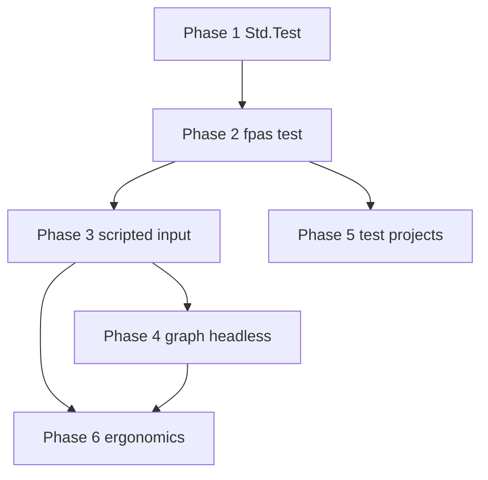

# Implementation plan (contributor guide)

Step-by-step tasks to implement the FPAS test framework. Read [`README.md`](README.md) for goals and phase overview.

**How to track:** mark tasks `- [x]` when complete; leave `- [ ]` open. Update the [progress summary](#progress-summary) counts and phase headers when a section is finished. Tick phase gates in [`README.md`](README.md) when all verification items for that phase pass.

**Spec drafts:** [`std-test.md`](std-test.md) · [`runner.md`](runner.md) · [`scripted-input.md`](scripted-input.md)

**Verify after each phase:** `cargo fmt`, `cargo build --workspace`, `cargo test --workspace`

---

## Progress summary

| Phase | Tasks | Done | Verification |
|-------|-------|------|--------------|
| [1 — Std.Test](#phase-1--stdtest-assertions) | 35 | 33 | [§ 1.8](#18-phase-1-verification) |
| [2 — fpas test](#phase-2--fpas-test-runner) | 22 | 22 | [§ 2.7](#27-phase-2-verification) |
| [3 — Scripted input](#phase-3--scripted-consoletui-input) | 13 | 13 | [§ 3.4](#34-phase-3-verification) |
| [4 — Graph headless](#phase-4--graph-headless-tests) | 9 | 7 | [§ 4.4](#44-phase-4-verification) |
| [5 — Test projects](#phase-5--test-projects-and-workspace) | 8 | 8 | [§ 5.4](#54-phase-5-verification) |
| [6 — Ergonomics](#phase-6--quality-and-ergonomics) | 7 | 6 | — |

_Update the **Done** column as you check off tasks above._

---

## Cross-cutting integration map

Every new `Std.Test` symbol touches this chain (same pattern as `Std.Env`, `Std.Proc`, …):

```text
docs/pascal/std/test.md
        ↓
fpas-std          unit name, symbols, runtime impl
        ↓
fpas-bytecode     TestIntrinsic enum + Intrinsic::Test(...)
        ↓
fpas-sema         register_std_test in std_registry/loaded/
        ↓
fpas-compiler     compile_test_call in std_calls/
        ↓
fpas-std or fpas-vm   run intrinsic (assert → failure + halt)
        ↓
fpas-compiler tests   compile_and_run / compile_run_err
```

Runner-only work (Phase 2+) stays in `fpas-cli` and reuses `fpas-project` + existing `Vm` APIs — no new bytecode.

Reference: [`docs/pascal/std/README.md`](../../pascal/std/README.md) § Shared implementation touchpoints.

---

## Phase 1 — `Std.Test` assertions

**Goal:** `fpas examples/pascal/test/assert_basics_test.fpas` runs; failed assert exits non-zero with a readable message.

**Phase complete when:** all tasks below are `[x]` and [§ 1.8 verification](#18-phase-1-verification) passes.

### 1.1 Specification

- [x] **1.1.1** — `docs/pascal/std/test.md` — **CREATE** canonical user spec from [`std-test.md`](std-test.md)
- [x] **1.1.2** — `docs/pascal/std/README.md` — **MODIFY** add `Std.Test` index entry
- [x] **1.1.3** — `docs/pascal/11-stdlib.md` — **MODIFY** list `Std.Test` if that file enumerates units

### 1.2 `fpas-std` — unit registry and runtime

- [x] **1.2.1** — `crates/fpas-std/src/std_units/units.rs` — **MODIFY** add `STD_UNIT_TEST = "Test"`, append to `STD_UNITS_KNOWN`
- [x] **1.2.2** — `crates/fpas-std/src/std_units/symbols/names.rs` (or equivalent) — **MODIFY** add symbol constants
- [x] **1.2.3** — `crates/fpas-std/src/std_units/symbols/groups.rs` — **MODIFY** add `STD_TEST_SYMBOLS` slice
- [x] **1.2.4** — `crates/fpas-std/src/std_units/mod.rs` — **MODIFY** `canonical_std_unit_from_tail("test")`, `std_unit_symbols` match arm
- [x] **1.2.5** — `crates/fpas-std/src/test/mod.rs` — **CREATE** module root
- [ ] **1.2.6** — `crates/fpas-std/src/test/state.rs` — deferred (no separate state file; failures use **F4023** diagnostic)
- [x] **1.2.7** — `crates/fpas-std/src/test/assert.rs` — **CREATE** assert helpers
- [x] **1.2.8** — `crates/fpas-std/src/lib.rs` — **MODIFY** `mod test;`

**Assert failure behavior (decision):** intrinsic handler prints diagnostic to stderr (reuse `fpas_diagnostics` style), then returns a dedicated `StdError` that the VM maps to **`Op::Halt`** with process exit code **1**. Do not use uncontrolled `panic!` in Rust.

### 1.3 `fpas-bytecode` — intrinsics

- [x] **1.3.1** — `crates/fpas-bytecode/src/intrinsic/test.rs` — **CREATE** `TestIntrinsic` enum
- [x] **1.3.2** — `crates/fpas-bytecode/src/intrinsic/mod.rs` — **MODIFY** wire `Test(TestIntrinsic)`
- [x] **1.3.3** — `crates/fpas-bytecode/src/lib.rs` — **MODIFY** re-export `TestIntrinsic`
- [x] **1.3.4** — `crates/fpas-bytecode/src/intrinsic/tests.rs` — **MODIFY** round-trip tests

Initial variants: `AssertTrue = 0`, `AssertFalse = 1`, `AssertEqualsInteger = 2`, `Fail = 3`, `Skip = 4`.

- [x] **1.3.5** — overload `AssertEquals` for `boolean`, `string`, `real` — separate intrinsics per type

### 1.4 `fpas-sema` — registration

- [x] **1.4.1** — `crates/fpas-sema/src/std_registry/loaded/test.rs` — **CREATE** `register_std_test`
- [x] **1.4.2** — `crates/fpas-sema/src/std_registry/loaded/mod.rs` — **MODIFY** `mod test;`, match arm
- [x] **1.4.3** — `crates/fpas-sema/src/tests/integration/std_units/test.rs` — **CREATE** `check_ok` fixtures using `uses Std.Test`

### 1.5 `fpas-compiler` — lowering

- [x] **1.5.1** — `crates/fpas-compiler/src/compiler/std_calls/test.rs` — **CREATE** `compile_test_call`
- [x] **1.5.2** — `crates/fpas-compiler/src/compiler/std_calls/mod.rs` — **MODIFY** wire `compile_test_call`
- [x] **1.5.3** — `crates/fpas-compiler/src/tests/std_library/test.rs` — **CREATE** integration tests
- [x] **1.5.4** — `crates/fpas-compiler/src/tests/std_library/mod.rs` — **MODIFY** `mod test;`

### 1.6 `fpas-std` / `fpas-vm` — intrinsic dispatch

- [x] **1.6.1** — `crates/fpas-std/src/intrinsics.rs` — **MODIFY** route `Intrinsic::Test(...)`
- [x] **1.6.2** — `crates/fpas-std/src/test/intrinsic.rs` — **CREATE** pop stack args, call assert helpers
- [x] **1.6.3** — not needed: VM already surfaces `StdError` as runtime diagnostic (**F4023**)
- [ ] **1.6.4** — deferred until Phase 2 runner

**Skip behavior:** `Skip` sets skipped flag, prints optional message, **`Halt` with exit 0**.

### 1.7 Examples and CLI smoke

- [x] **1.7.1** — `examples/pascal/test/assert_basics_test.fpas` — **CREATE** (renamed from `assert_basics.fpas` for `*_test.fpas` discovery)
- [x] **1.7.2** — `examples/pascal/test/assert_fail_demo.fpas` — **CREATE** documents expected failure (manual run)
- [x] **1.7.3** — `examples/README.md` — **MODIFY** `fpas test` section for `examples/pascal/test/`
- [x] **1.7.4** — `crates/fpas-cli/src/main_tests/examples.rs` — **MODIFY** add to allowlist

### 1.8 Phase 1 verification

- [x] `uses Std.Test` resolves in sema
- [x] `AssertEquals(4, 2+2)` compiles and runs
- [x] Failed assert: message includes expected/actual values (**F4023**)
- [x] `Skip('reason')` exits 0
- [x] `cargo test -p fpas-compiler std_library::test` passes
- [x] `fpas examples/pascal/test/assert_basics_test.fpas` exits 0

---

## Phase 2 — `fpas test` runner

**Goal:** `fpas test examples/pascal/test/` discovers `*_test.fpas`, runs each, prints summary.

**Phase complete when:** all tasks below are `[x]` and [§ 2.7 verification](#27-phase-2-verification) passes.

### 2.1 CLI routing

- [x] **2.1.1** — `crates/fpas-cli/src/cli_input.rs` — **MODIFY** `CliMode::Test`, parse `fpas test`, extend `CLI_HELP`, `ResolvedCli::Test(TestCliConfig)`
- [x] **2.1.2** — `crates/fpas-cli/src/cli_run.rs` — **MODIFY** dispatch `ResolvedCli::Test` → `cli_test::test_cli`
- [x] **2.1.3** — `crates/fpas-cli/src/main.rs` — **MODIFY** `mod cli_test;`
- [x] **2.1.4** — `crates/fpas-cli/src/cli_test/mod.rs` — **CREATE** main runner logic (+ `discover`, `run`, `report`)
- [x] **2.1.5** — `docs/pascal/10-projects.md` — **MODIFY** document `fpas test` (from [`runner.md`](runner.md))

### 2.2 Discovery

- [x] **2.2.1** — `crates/fpas-cli/src/cli_test/discover.rs` — **CREATE** given path: single file, directory glob, or project load
- [x] **2.2.2** — Filter sources: basename ends with `_test.fpas` (case-insensitive)
- [x] **2.2.3** — Each file must parse as `program` (not bare `unit`) — error with hint if wrong
- [x] **2.2.4** — `crates/fpas-project` — **MODIFY** only if needed: expose linked source list (prefer existing load API from `cli_check`) — not needed; reused load API

Reuse: `cli_check.rs` (project load), `main_tests/support.rs` (`run_source_and_capture_output`).

### 2.3 Execution loop

- [x] **2.3.1** — `crates/fpas-cli/src/cli_test/run.rs` — **CREATE** compile, `Vm::new`, `run()`, collect output per test
- [x] **2.3.2** — `crates/fpas-cli/src/cli_test/report.rs` — **CREATE** `TestResult`, human summary, exit code aggregation
- [x] **2.3.3** — Exit codes per [`runner.md`](runner.md): 0 ok, 1 assert fail, 2 compile, 3 runtime
- [x] **2.3.4** — Optional `--fail-fast` (stop after first failure)
- [x] **2.3.5** — Optional `--list` (print paths only)

### 2.4 Golden stdout (optional in Phase 2)

- [x] **2.4.1** — Sidecar `*.expect.stdout` next to test file
- [x] **2.4.2** — `cli_test/expect_stdout.rs` + `run.rs` — compare `vm.output().lines` after successful run
- [x] **2.4.3** — Mismatch → test failure with diff hint

### 2.5 Tests

- [x] **2.5.1** — `crates/fpas-cli/src/main_tests/test_runner.rs` — **CREATE** temp dir with 2–3 `*_test.fpas`, invoke `test_cli`
- [x] **2.5.2** — `crates/fpas-cli/src/main_tests/mod.rs` — **MODIFY** `mod test_runner;`
- [x] **2.5.3** — `crates/fpas-cli/src/cli_test/mod.rs` — unit tests for directory run + `--list`

### 2.6 Examples

- [x] **2.6.1** — `examples/pascal/test/readln_test.fpas` — **CREATE** (script in Phase 3)
- [x] **2.6.2** — `examples/pascal/test/readln_test.script.toml` — **CREATE** (Phase 3)
- [x] **2.6.3** — `examples/pascal/test/tests.fpasprj` — **CREATE** (optional) bundles test sources

### 2.7 Phase 2 verification

- [x] `fpas test examples/pascal/test/` — all pass
- [x] One failing test → exit 1, summary shows FAIL line (covered by `cli_test` unit test)
- [x] `fpas test` with no args discovers project like `fpas check` (if single `.fpasprj` in cwd)
- [x] `cargo test -p fpas-cli test_runner` passes
- [x] `cargo test -p fpas-cli test_cli` passes

---

## Phase 3 — Scripted console/TUI input

**Goal:** `tui_escape_test.fpas` + `.script.toml` runs without human input.

**Phase complete when:** all tasks below are `[x]` and [§ 3.4 verification](#34-phase-3-verification) passes.

### 3.1 Script parser

- [x] **3.1.1** — `crates/fpas-cli/Cargo.toml` — **MODIFY** ensure `toml` dependency (if not already)
- [x] **3.1.2** — `crates/fpas-cli/src/test_script/mod.rs` — **CREATE**
- [x] **3.1.3** — `crates/fpas-cli/src/test_script/parse.rs` — **CREATE** TOML → `Vec<ScriptEvent>` per [`scripted-input.md`](scripted-input.md)
- [x] **3.1.4** — `crates/fpas-cli/src/test_script/apply.rs` — **CREATE** `apply_script(vm: &mut Vm, events: &[ScriptEvent])`
- [x] **3.1.5** — `crates/fpas-cli/src/test_script/console.rs` — **CREATE** map to `ConsoleEvent` / `push_readln_input` / `push_readkey_input`
- [x] **3.1.6** — Reuse `fpas_std::{ConsoleEvent, ConsoleKeyEvent, key_kind_index, …}` — no duplicate string tables

### 3.2 Runner integration

- [x] **3.2.1** — `cli_test/run.rs` — before `vm.run()`: if `<stem>.script.toml` exists beside test file, parse and apply
- [x] **3.2.2** — `cli_input.rs` / `cli_test.rs` — `--script <path>` overrides auto-discovery
- [x] **3.2.3** — Parse errors → exit 2 with file/line hint

### 3.3 Examples and tests

- [x] **3.3.1** — `examples/pascal/test/tui_escape_test.fpas` — **CREATE**
- [x] **3.3.2** — `examples/pascal/test/tui_escape_test.script.toml` — **CREATE**
- [x] **3.3.3** — `crates/fpas-cli/src/test_script/tests.rs` — **CREATE** unit tests for TOML parse + apply
- [x] **3.3.4** — `crates/fpas-cli/src/main_tests/test_runner.rs` — **MODIFY** end-to-end TUI test case
- [x] **3.3.5** — `examples/pascal/test/readln_test.fpas` + `readln_test.script.toml` — **CREATE** ReadLn sidecar smoke test
- [x] **3.3.6** — `examples/pascal/test/tui_mouse_test.fpas` + `.script.toml` — **CREATE** mouse dispatch smoke test

### 3.4 Phase 3 verification

- [x] Escape in script triggers TUI quit handler
- [x] Mouse `Down`/`Up` at (x,y) reaches `OnMouse` in hosted TUI test
- [x] Invalid script `type` → clear error before VM start
- [x] `cargo test -p fpas-cli test_script` passes
- [x] `fpas test examples/pascal/test/` runs `readln_test.fpas` with sidecar script

---

## Phase 4 — Graph headless tests

**Goal:** graph programs run in CI without native window; scripted graph events work.

**Phase complete when:** all tasks below are `[x]` and [§ 4.4 verification](#44-phase-4-verification) passes.

### 4.1 Headless mode in runner

- [x] **4.1.1** — `test_script/parse.rs` — **MODIFY** `[config] headless_graph = true`, graph event types
- [x] **4.1.2** — `test_script/graph.rs` — **CREATE** map to `GraphEvent`, `push_graph_event`
- [x] **4.1.3** — `cli_test/run.rs` — wrap `vm.run()` in `with_headless_graph_backend_for_tests` when config flag set

Reference: [`crates/fpas-compiler/src/tests/std_library/graph.rs`](../../../crates/fpas-compiler/src/tests/std_library/graph.rs)

### 4.2 Examples

- [x] **4.2.1** — `examples/pascal/test/graph_smoke_test.fpas` — **CREATE** minimal open/draw/close
- [x] **4.2.2** — `examples/pascal/test/graph_smoke_test.script.toml` — **CREATE** quit key event

### 4.3 Phase 4b (optional) — pixel assertions

- [ ] **4.3.1** — Evaluate `Std.Test.AssertPixel` vs runner-only Rust hook — defer unless strong need
- [ ] **4.3.2** — If added: expose `last_headless_graph_frame_for_tests` through intrinsic

### 4.4 Phase 4 verification

- [x] Graph test completes in CI (no window flash)
- [x] Scripted `graph_key` / `graph_mouse` consumed by `PollEvent` loop
- [x] Native graph backend not selected when headless flag set
- [x] `cargo test -p fpas-cli test_script` includes headless graph apply test
- [x] `fpas test examples/pascal/test/graph_smoke_test.fpas` passes

---

## Phase 5 — Test projects and workspace

**Goal:** dedicated test projects; workspace-wide `fpas test`.

**Phase complete when:** all tasks below are `[x]` and [§ 5.4 verification](#54-phase-5-verification) passes.

### 5.1 Project kind

- [x] **5.1.1** — `crates/fpas-project/src/` — **MODIFY** accept `kind = "test"` in manifest parser
- [x] **5.1.2** — `test` projects require `main`; reject bare `fpas my-tests.fpasprj` run (only `fpas test`)
- [x] **5.1.3** — `docs/pascal/10-projects.md` — **MODIFY** document `kind = "test"`
- [x] **5.1.4** — `docs/rust/project-loading.md` — **MODIFY** contributor notes

### 5.2 Workspace discovery

- [x] **5.2.1** — `cli_test/discover.rs` — **MODIFY** no path: find workspace, collect `kind = "test"` members
- [x] **5.2.2** — `[test]` manifest section optional: per-file `script`, `headless_graph` overrides
- [x] **5.2.3** — `examples/pascal/test/tests.fpasprj` — **CREATE** bundles example test sources

Example layout:

```text
apps/my-app/
 ├── my-app.fpasprj          kind = "program"
 └── my-app-tests.fpasprj    kind = "test", depends on my-app library units
```

### 5.4 Phase 5 verification

- [x] `fpas test` at workspace root runs test members (`examples/pascal/monorepo`)
- [x] `fpas examples/pascal/test/tests.fpasprj` runs all bundled tests
- [x] `fpas my-app-tests.fpasprj` errors with hint to use `fpas test` (via `fpas run`)
- [x] `fpas check` still accepts test projects
- [x] `cargo test -p fpas-cli test_project` passes

---

## Phase 6 — Quality and ergonomics

Implement incrementally; no fixed order. Mark each item `[x]` when shipped.

- [x] **6.1** — `--filter <pat>` in `cli_test/discover.rs` — substring on path
- [x] **6.2** — `--report json` in `cli_test/report.rs` — CI structured output on stdout
- [x] **6.3** — Parallel test execution in `cli_test/parallel.rs` — `--jobs <n>` (`0` = machine parallelism); one VM per test; headless graph uses thread-local backend
- [x] **6.4** — Setup/Teardown hooks in `cli_test/hooks.rs` + `run.rs` — parameterless `Setup` / `Teardown` in non-test helper units; runner executes before/after each test
- [x] **6.5** — TUI screen snapshot in `fpas-std` (`ScreenSnapshot`) + runner `*.expect.screen` sidecar
- [x] **6.6** — `--timeout <secs>` in `cli_test/timeout.rs` — cooperative abort for hung tests
- [ ] **6.7** — Property/fuzz for event ordering — Rust only, out of FPAS scope

---

## Dependency graph (implementation order)



Phases 3 and 5 can overlap after Phase 2. Phase 4 depends on Phase 3 script infrastructure.

---

## Files created by phase (summary)

```text
Phase 1
 docs/pascal/std/test.md
 crates/fpas-std/src/test/{mod,state,assert,intrinsic}.rs
 crates/fpas-bytecode/src/intrinsic/test.rs
 crates/fpas-sema/src/std_registry/loaded/test.rs
 crates/fpas-compiler/src/compiler/std_calls/test.rs
 crates/fpas-compiler/src/tests/std_library/test.rs
 examples/pascal/test/assert_basics_test.fpas

Phase 2
 crates/fpas-cli/src/cli_test.rs
 crates/fpas-cli/src/cli_test/{discover,expect_stdout,hooks,parallel,run,report,timeout}.rs
 crates/fpas-cli/src/main_tests/test_runner.rs

Phase 3
 crates/fpas-cli/src/test_script/{mod,parse,apply,console,tests}.rs
 examples/pascal/test/tui_escape_test.fpas
 examples/pascal/test/tui_escape_test.script.toml

Phase 4
 crates/fpas-cli/src/test_script/graph.rs
 examples/pascal/test/graph_smoke_test.fpas (+ .script.toml)

Phase 5
 (mostly modifications to fpas-project, cli_test/discover, docs)
```

---

## Risks and mitigations

| Risk | Mitigation |
|------|------------|
| Assert failure indistinguishable from runtime error | Dedicated `TestIntrinsic` + exit code 1; document in runner |
| TUI tests hang without script | Runner timeout flag (Phase 6); Phase 3 docs require script for interactive tests |
| Graph native window in CI | Mandatory `headless_graph` for graph tests in runner |
| Duplicate enum string tables in script parser | Import indices from `fpas-std` only |
| `AssertEquals` overload ambiguity | Separate intrinsics per type in sema |

---

## Related contributor docs

| Document | Use when |
|----------|----------|
| [`docs/rust/project-loading.md`](../../rust/project-loading.md) | Phase 2/5 runner + project load |
| [`docs/pascal/std/README.md`](../../pascal/std/README.md) | Any `Std.*` wiring |
| [`tui-application-framework.md`](../tui-application-framework.md) | Phase 3 TUI test expectations |
| [`examples/README.md`](../../../examples/README.md) | Non-interactive allowlist updates |
